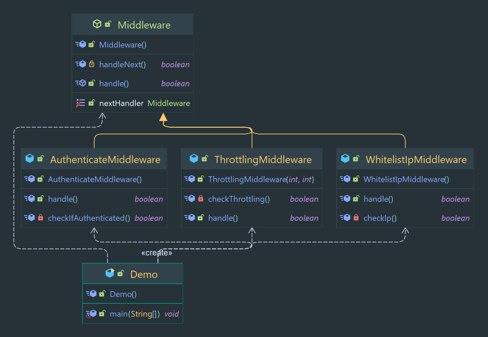

# Chain Of Responsibility Pattern

A pattern where a request is passed through a chain of objects, each object has the ability to handle the request or
pass it on to the next object in the chain.

> Classification : Behavioral design pattern.

### Pros

* decouples sender and receiver of a request.
* allows for dynamic modification of the request handling.

### Cons

* can be difficult to understand.
* can lead to a long chain of objects.

## Code Example

