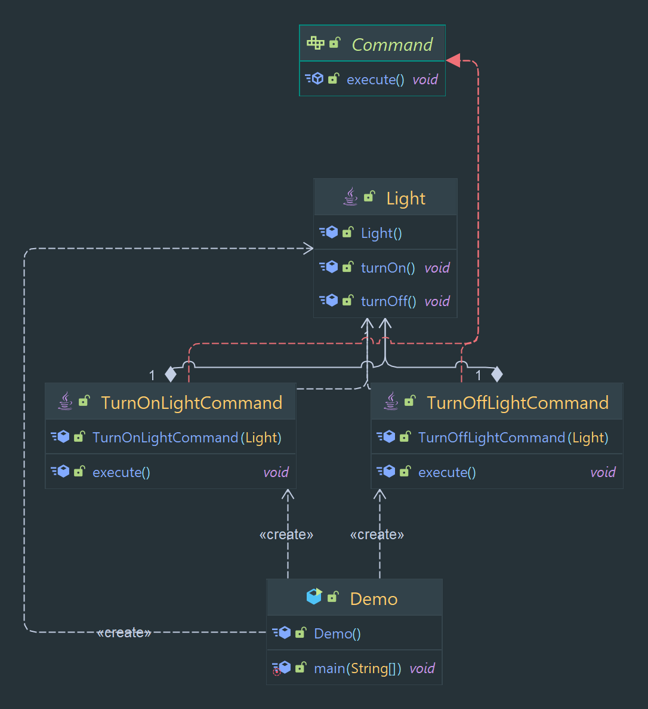

# Command Pattern

A pattern that encapsulates a request as an object, allowing for parametrization of clients with different requests.

> Classification : Behavioral design pattern.

### Pros

* decouples classes that invoke operations from classes that perform these operations.
* allows for undo/redo, can be used to implement deferred execution of operations.

### Cons

* can lead to an increase in the number of objects and classes in the system.
* can make the code less readable.

## Code Example

