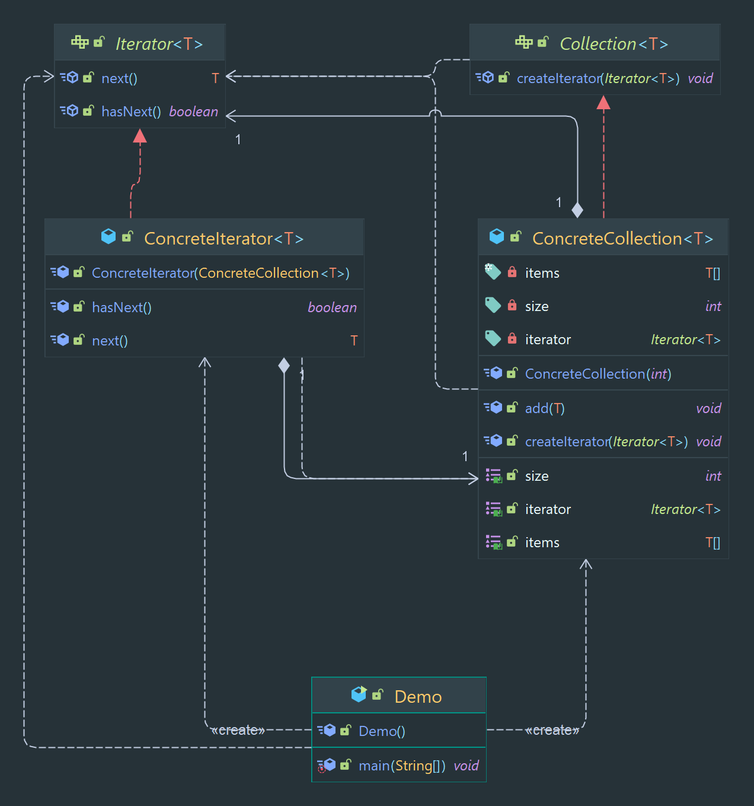

# Iterator Pattern

A pattern Allows for traversal of elements in a collection without exposing the underlying representation.

> Classification : Behavioral design pattern.

### Pros

* It allows clients to traverse a collection of objects without knowing the underlying representation of the collection.
  This means that clients can work with different types of collections in a consistent way, making the code more
  flexible and reusable.

* It provides a way to access elements of a collection in a sequential manner, without exposing the internal structure
  of the collection to the client.

* It allows for multiple iterators to be used on the same collection, which can be useful in certain situations.

### Cons

* can lead to an increase in the number of objects and classes in the system,
* can make the code less readable.

## Code Example

