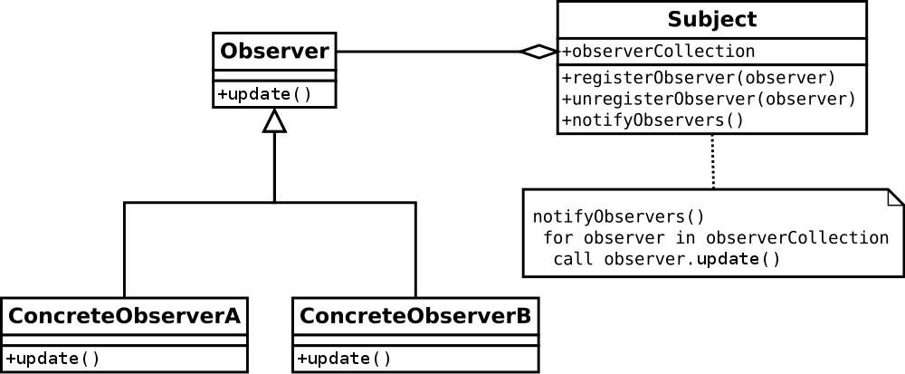
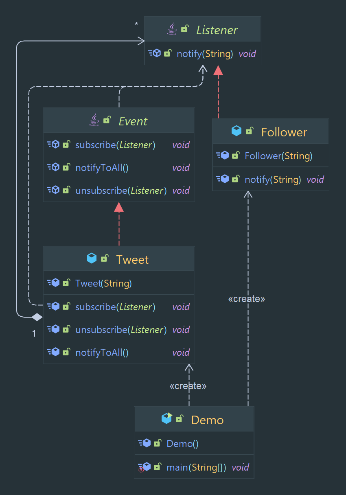

# Observer Pattern

Allows for a one-to-many relationship between objects, where one object is the subject and the many objects are
observers.

> Classification : Behavioral design pattern.

### Pros

* allows for loose coupling between objects.
* allows for easy modification of the observer collection.
* allows for broadcast communication.

### Cons

* can lead to performance issues with a large number of observers, can make the code more complex

## Class Diagram

## Code Example

