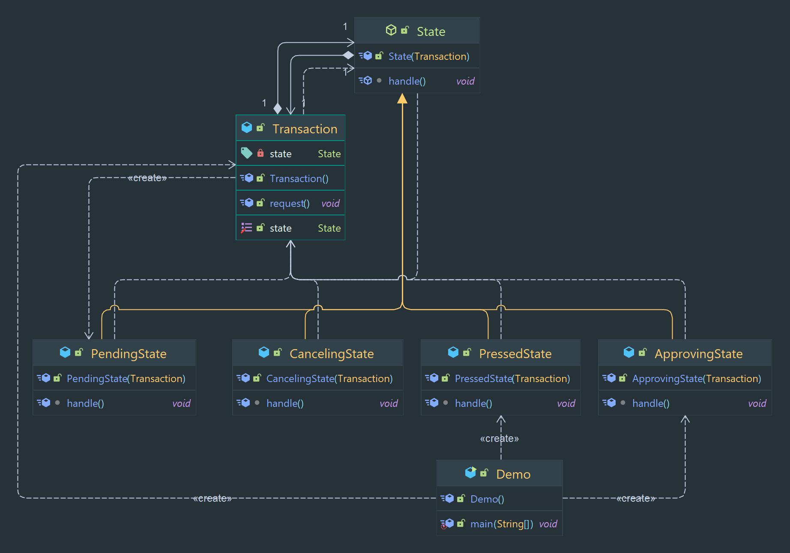

# State Pattern

Allows an object to change its behavior based on its internal state.

## Props

* allows for more flexibility and fewer branching statements in the code.
* allows for easy addition of new states.

## Cons

* can make the code more complex, can lead to an increase in the number of classes in the system.

> Classification : Behavioral design pattern.

## Code Example

