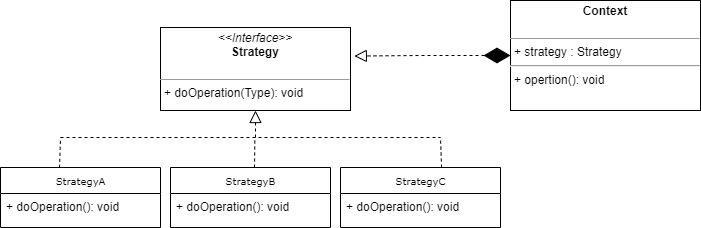

# Strategy Designe Pattern

Allows for the selection of an algorithm at runtime.

> Classification : Behavioral design pattern.

### Pros:

* allows for flexibility and easy extension of the application.
* allows for the selection of the appropriate algorithm for the current situation.

### Cons:

* can lead to an increase in the number of classes in the system.

## Class Diagram

## Code Example

We have a class called "logger." The main idea behind this class to create logs for text or errors on files, consoles,
or databases.

