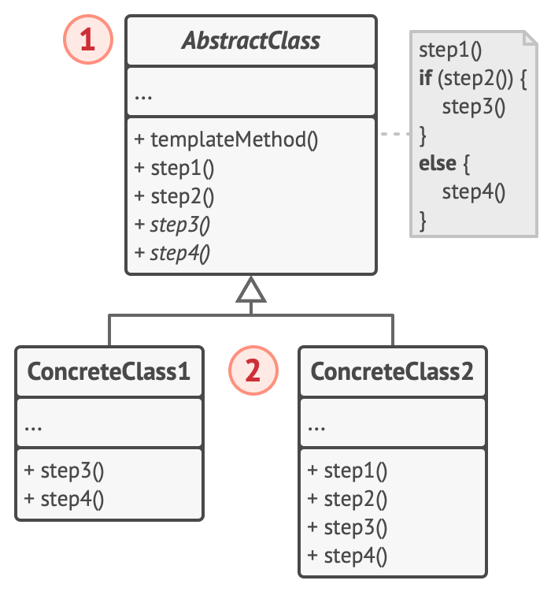
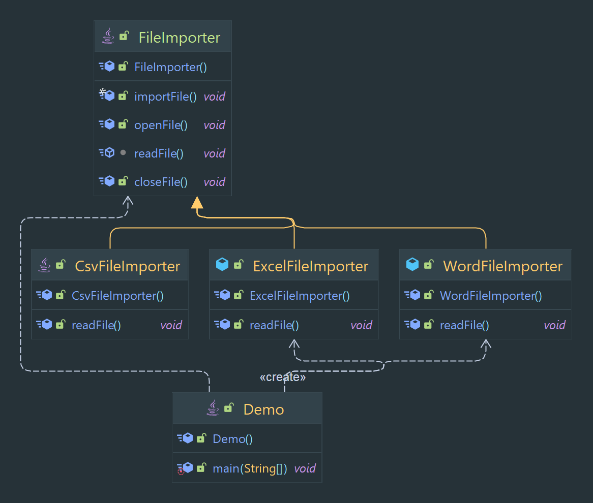

# Template Method Designe Pattern

Defines the skeleton of an algorithm in a method, allowing subclasses to provide specific implementation details.

> Classification : Behavioral design pattern.

## Pros:

* allows for code reuse.
* allows for easy extension of the algorithm.

## Cons:

* can lead to an increase in the number of classes in the system

## Class Diagram

## Code Example

