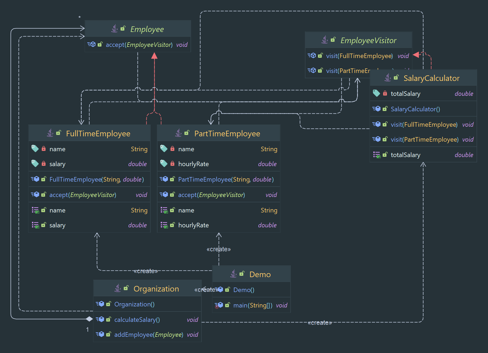

# Designe Pattern

Allows for the addition of new operations to a set of classes without modifying them.

> Classification : Behavioral design pattern.

## Props

* allows for easy addition of new operations.
* allows for separation of concerns.

## Cons

* can lead to an increase in the number of classes in the system.

## Code Example

