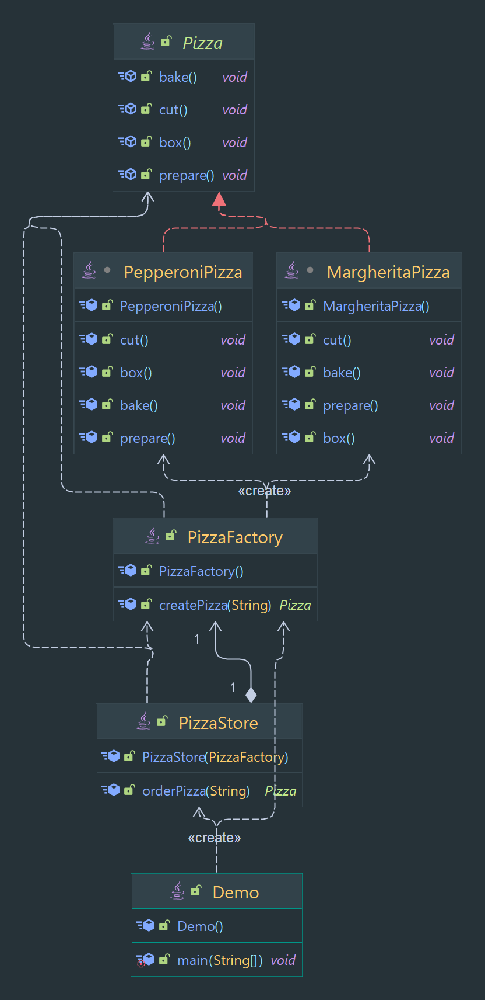

# Factory Pattern

Creates object without specifying the exact class of object that will be created.

> Classification : Creational design pattern.

## Pros

* allows for the creation of objects without specifying their class.
* allows for the easy addition of new types of objects.

## Cons

* can lead to an increase in the number of classes in the system.

## Code Example

