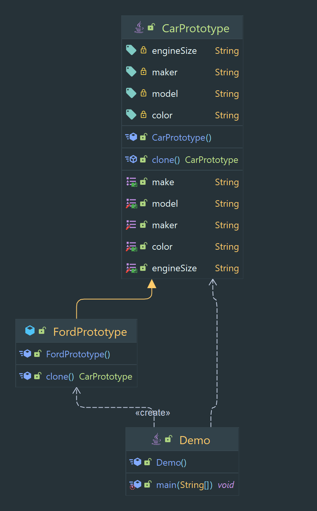

# Prototype Pattern

Creates new objects by cloning an existing object.

> Classification : Creational design pattern.

## Pros

* allows for the creation of new objects without specifying their class.
* allows for the easy creation of multiple instances of an object.

## Code Example

