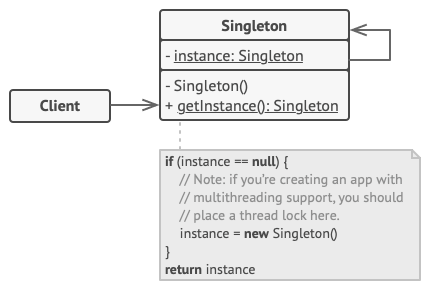

# Singleton Designe Pattern

Ensures that a class has only one instance and provides a global point of access to it.

> Classification : Creational design pattern.

## Pros

* ensures that a class has only one instance.
* provides a single point of control for an object.

## Cons

* can make the code more difficult to test
* can lead to issues with global state.

## Code Example

