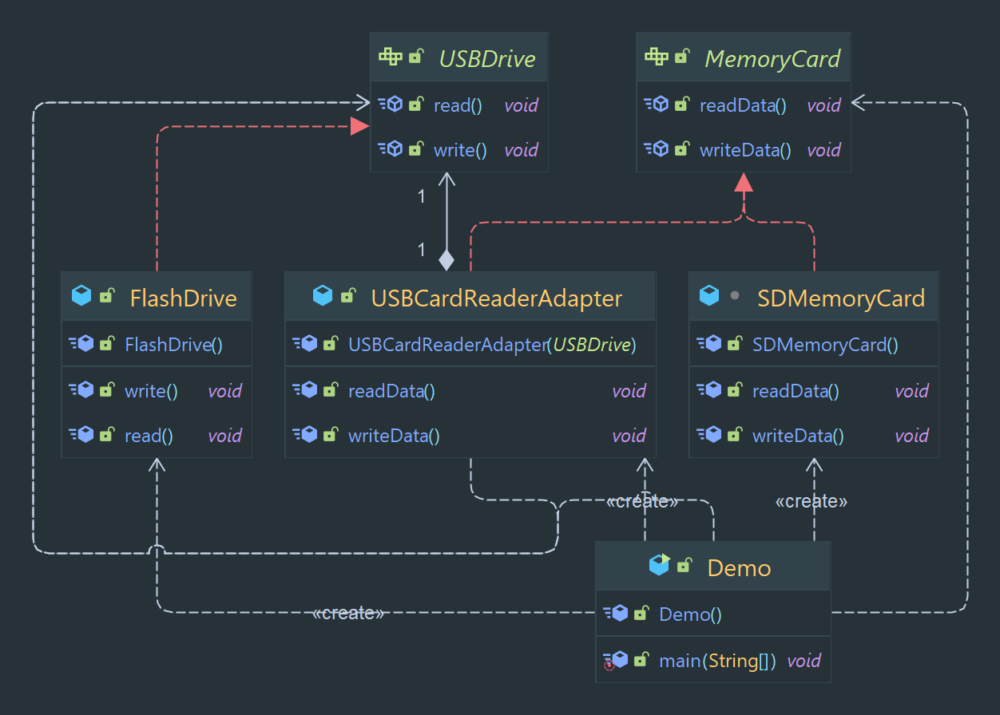

# Adapter Design Pattern

Allows for the adaptation of one interface to another, allowing classes to work together that couldn't otherwise because
of incompatible interfaces.

> Classification : Structural design pattern.

### Pros

* allows for the reuse of existing classes
* allows for the separation of concerns.

## Code Example

