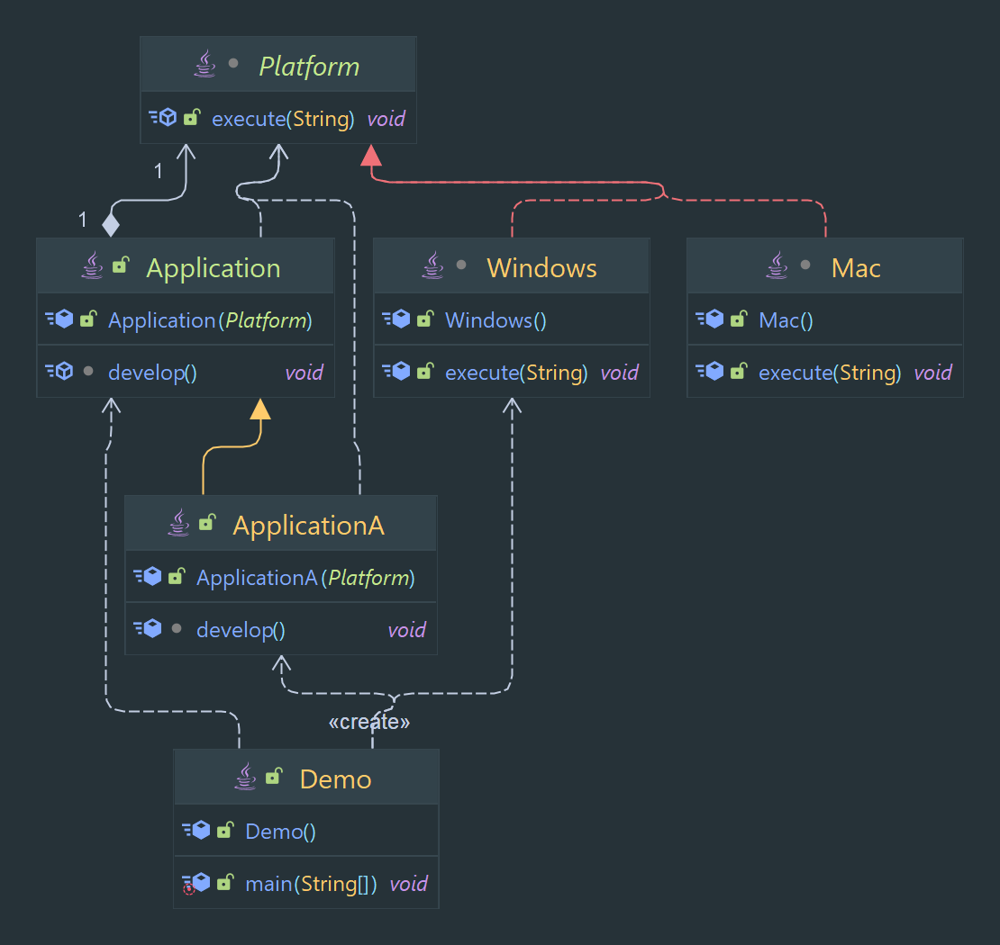

# Bridge Pattern

Separates an object's interface from its implementation, allowing for the two to vary independently.

> Classification : Structural design pattern.

### Pros

* allows for the separation of concerns.
* allows for easy extension of the implementation.

## Code Example

