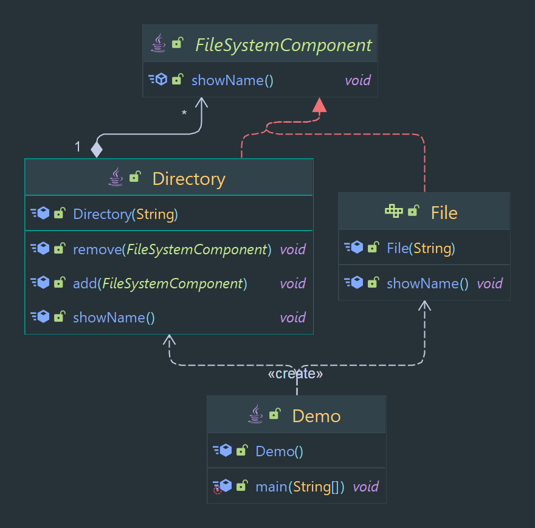

# Composite Pattern

Allows for the composition of objects into tree structures to represent part-whole hierarchies.

> Classification : Structural design pattern.

### Pros

* allows for the representation of part-whole hierarchies.
* allows for the uniform treatment of both individual objects and compositions

## Code Example

