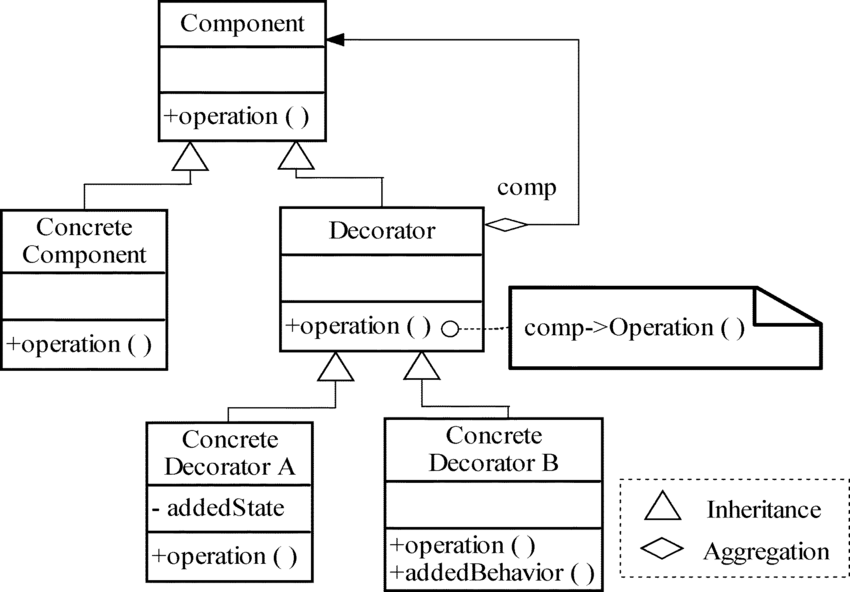
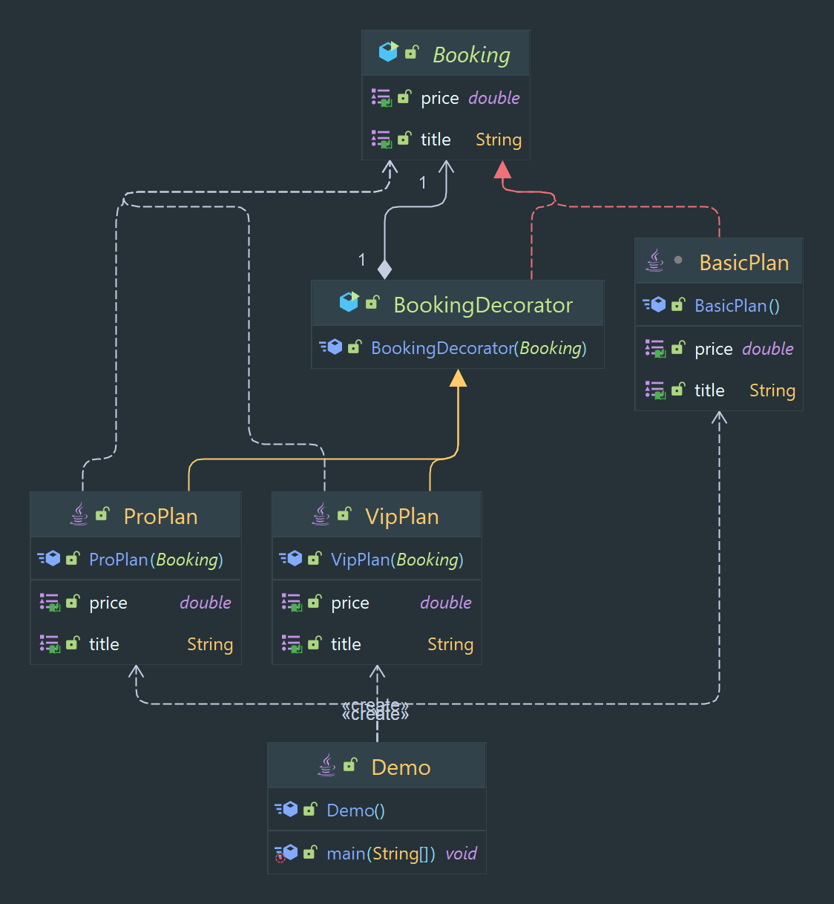

# Decorator Designe Pattern

Allows for the dynamic addition of behavior to objects.

> Classification : Structural design pattern.

### Pros:

* allows for easy addition of behavior to objects
* allows for the reuse of existing objects

### Cons:

* Results in problems if there is code that relies on the concrete component’s type

## Class Diagram

## Code Example

