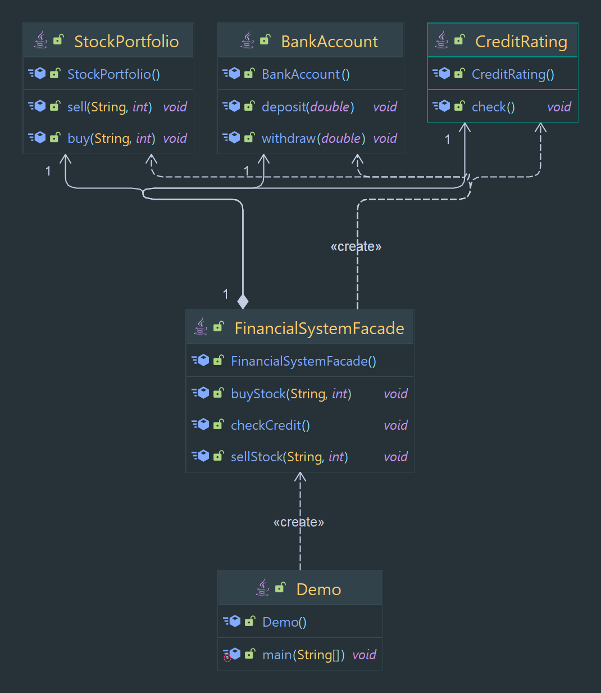

# Facade Designe Pattern

Provides a simplified interface to a complex system.

> Classification : Structural design pattern.

### Pros:

* allows for the separation of concerns.
* allows for a simpler and more convenient interface to a complex system.

## Code Example

