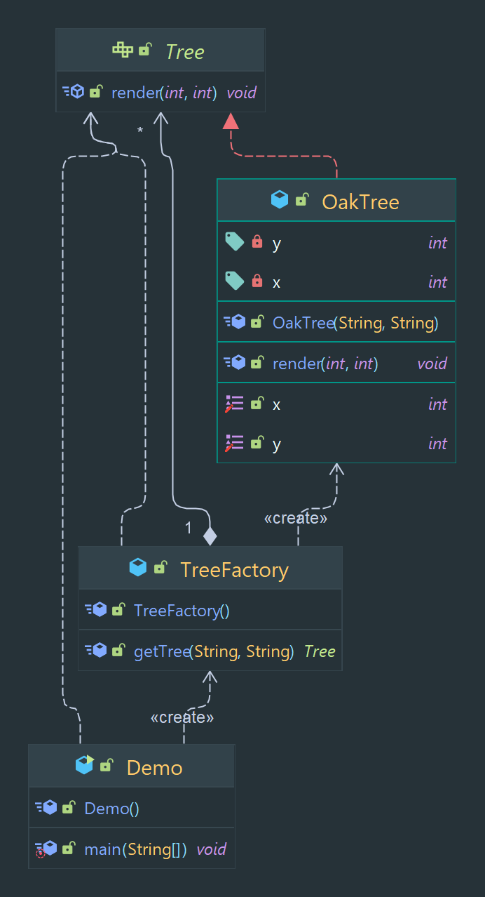

# Flyweight Designe Pattern

Allows for the efficient usage of large numbers of fine-grained objects.

> Classification : Structural design pattern.

### Pros:

* allows for efficient usage of large numbers of objects.
* allows for the reuse of existing objects.

## Code Example

