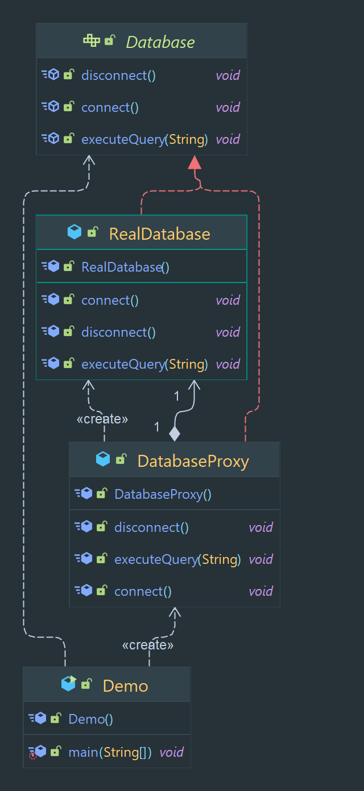

# Proxy Designe Pattern

Proxy: Provides a surrogate or placeholder for another object to control access to it.

> Classification : Structural design pattern.

### Pros:

* allows for the control of access to an object
* allows for the representation of remote objects.

## Code Example

